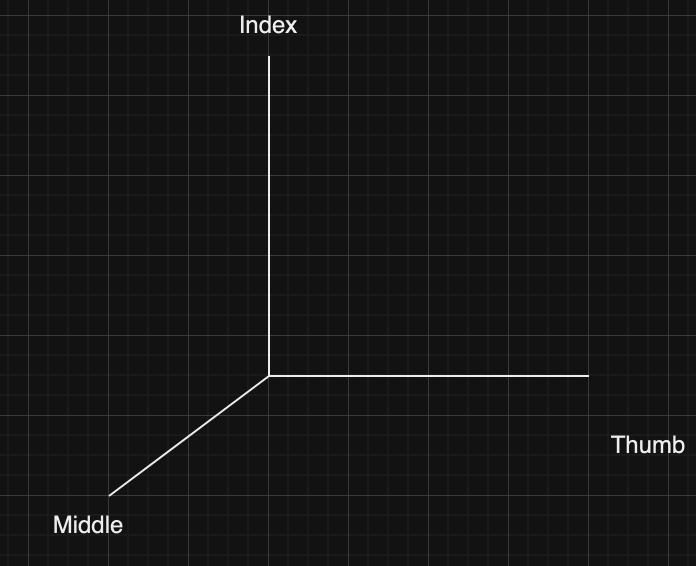
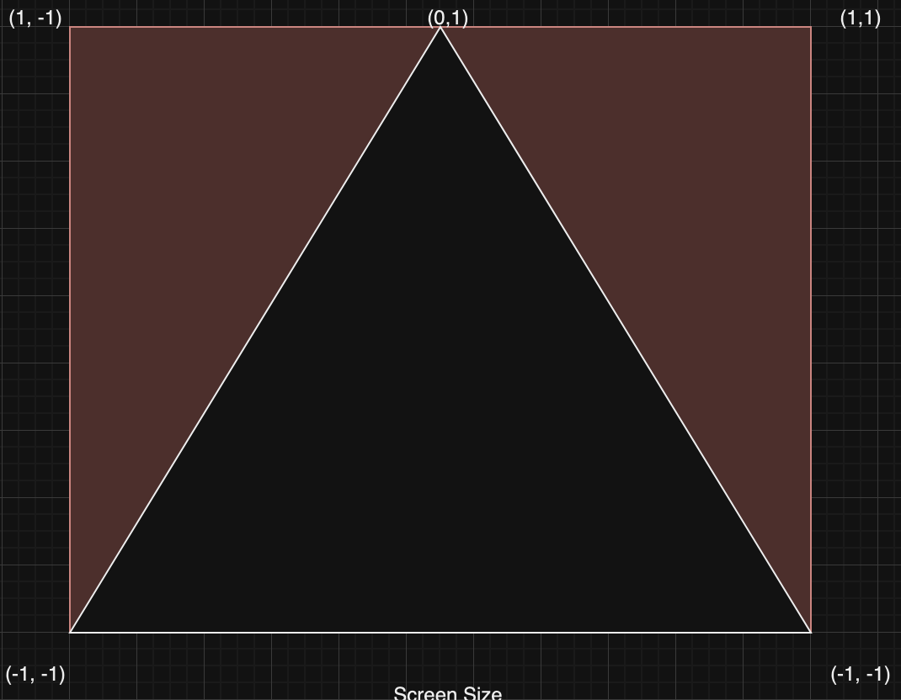

## Coordinate System in OpenGL.
**This is hard set by the graphics card and can't be altered.**

OpenGL utilizes the right-hand rule to find the coordinates:

*Important to note that the Middle finger points behind you instead of to your front*

---
Utilizing this knowledge we can derive a simple $3\times 3$ matrix to draw a triangle.
(z is 0 since we are only drawing in 2D space).

$$\begin{pmatrix} -1 & -1 & 0 \\\ 1 & -1 & 0 \\\ 0 & 1 & 0 \\\end{pmatrix}$$

## Shaders
Shaders are how we can assign colours (shades) to our objects. OpenGL requires at least 2 shader objects - **Vertex Shader** → Rendered for every vertex (x, y, z) and **Fragment Shader** → Rendered for each sample (If we use 4x antialiasing, then 4 samples per pixel). 

These are coded in GLSL (*GL Shader Language*), all shaders are compiled at run-time, so they must be re-rendered on every start.